# Laboratorio 06: Comandos de Terminal en Linux

**Curso:** Sistemas Operativos  
**Tema:** Manejo de comandos de terminal en Linux  
**Autor:** [Jauregui Bendezu, Frank Kevin]  
**Fecha:** [07/05/2025]

---

## 🎯 Objetivos del Laboratorio

- ✅ Familiarización con el entorno de terminal de Linux.  
- ✅ Desarrollo de habilidades prácticas en la ejecución de comandos de terminal.  
- ✅ Progresión desde comandos básicos hasta tareas más avanzadas.  
- ✅ Comprensión de conceptos fundamentales de la línea de comandos de Linux.

---

## 🧩 Parte I: Comandos de Nivel Básico

### 📁 Ejercicio 1.1: Navegación y Gestión de Archivos

**🎯 Objetivo:**  
Crear una estructura de directorios y realizar operaciones básicas con archivos.

**💡 Solución:**

```bash
# 1. Verificar ubicación actual
pwd

# 2. Crear la estructura de directorios
mkdir -p ~/laboratorio/datos/entrada
mkdir -p ~/laboratorio/datos/salida
mkdir -p ~/laboratorio/scripts
mkdir -p ~/laboratorio/respaldo

# 3. Verificar la estructura creada
ls -la ~/laboratorio
```


📁 Ejercicio 1: Operaciones con Archivos

🎯 Objetivo:
Practicar navegación entre directorios y manipulación básica de archivos.

💡 Solución:

```bash
# 4. Navegar entre los diferentes directorios
cd ~/laboratorio
cd datos
cd entrada

# 5. Crear tres archivos de texto vacíos
touch datos1.txt datos2.txt config.cfg

# 6. Copiar "datos1.txt" al directorio "respaldo"
cp datos1.txt ~/laboratorio/respaldo/

# 7. Mover "config.cfg" al directorio raíz del laboratorio
mv config.cfg ~/laboratorio/

# 8. Eliminar "datos2.txt"
rm datos2.txt
```

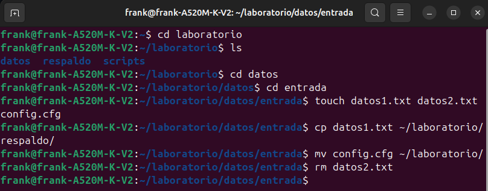

### 📁 Ejercicio 1.2: Visualización y Edición Básica

🎯 Objetivo:
Crear archivos con contenido, visualizar su información y realizar ediciones simples con herramientas básicas.

💡 Solución:

```bash
# 1. Crear un archivo con contenido
echo "Esta es la primera línea del archivo" > ~/laboratorio/datos/entrada/datos1.txt
echo "Esta es la segunda línea del archivo" >> ~/laboratorio/datos/entrada/datos1.txt
echo "Esta es la tercera línea del archivo" >> ~/laboratorio/datos/entrada/datos1.txt
echo "Esta es la cuarta línea del archivo" >> ~/laboratorio/datos/entrada/datos1.txt
echo "Esta es la quinta línea del archivo" >> ~/laboratorio/datos/entrada/datos1.txt

# 2. Visualizar contenido completo
cat ~/laboratorio/datos/entrada/datos1.txt

# 3. Visualizar las primeras 3 líneas
head -n 3 ~/laboratorio/datos/entrada/datos1.txt

# 4. Visualizar las últimas 2 líneas
tail -n 2 ~/laboratorio/datos/entrada/datos1.txt
```
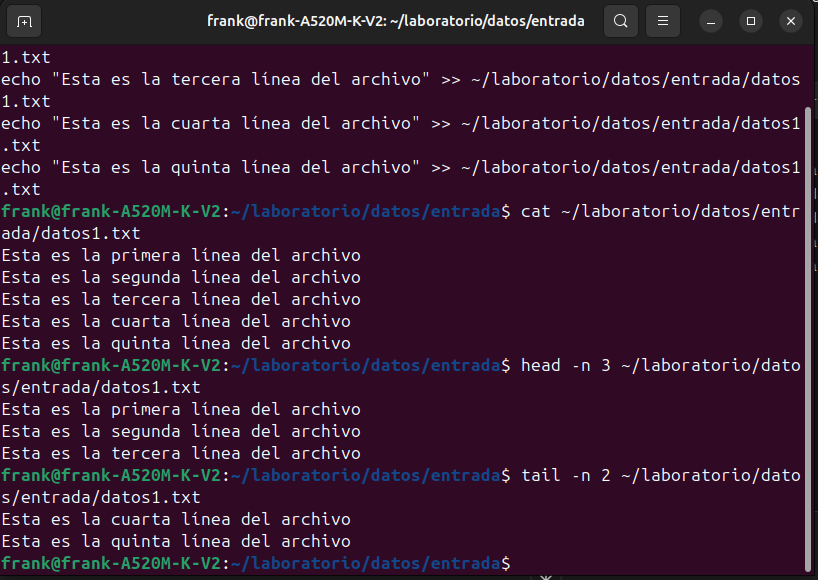

🗃️ Ejercicio 2: Manipulación de Archivos con Bucle y Editor

🎯 Objetivo:
Crear múltiples líneas con un bucle, visualizar partes del archivo y editar contenido.

💡 Solución:

```bash
# 1. Crear un archivo registro.log con 20 líneas
cd ~/laboratorio/datos
for i in {1..20}; do
    echo "Esta es la línea $i del registro" >> registro.log
done

# 2. Visualizar las primeras 5 líneas
head -n 5 registro.log

# 3. Visualizar las últimas 3 líneas
tail -n 3 registro.log

# 4. Abrir el archivo con nano y agregar una línea al inicio
nano registro.log
# Agregar manualmente: "# ARCHIVO DE REGISTRO" al inicio

# 5. Visualizar archivo completo
cat registro.log
```
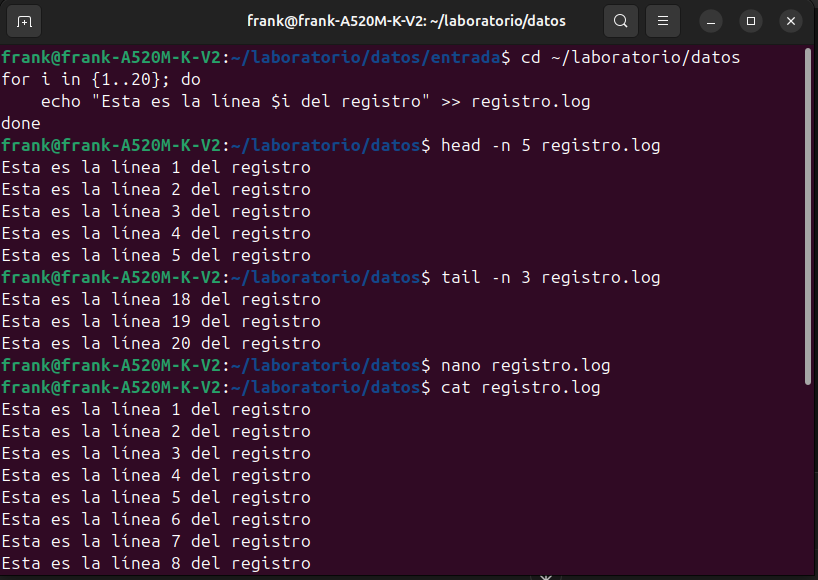

##  🔧 Parte II: Comandos de Nivel Intermedio
📄 Ejercicio 2.1: Búsqueda y Filtrado

🎯 Objetivo:
Buscar archivos y patrones dentro de archivos, y aprender a filtrar y procesar texto mediante herramientas de línea de comandos.

💡 Solución:
# 1. Crear un archivo de muestra

```bash
cd ~/laboratorio
echo "usuario1:x:1000:1000:Juan Pérez:/home/usuario1:/bin/bash" > usuarios.txt
echo "usuario2:x:1001:1001:María García:/home/usuario2:/bin/bash" >> usuarios.txt
echo "usuario3:x:1002:1002:Carlos López:/home/usuario3:/bin/zsh" >> usuarios.txt
echo "usuario4:x:1003:1003:Ana Martínez:/home/usuario4:/bin/bash" >> usuarios.txt
echo "usuario5:x:1004:1004:Pedro Sánchez:/home/usuario5:/bin/zsh" >> usuarios.txt

# 2. Buscar patrones con grep
grep "bash" usuarios.txt
grep -v "bash" usuarios.txt  # líneas que NO contienen "bash"
```
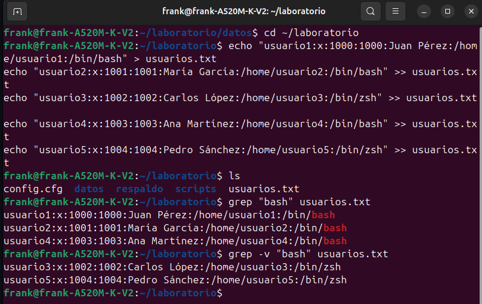

## 📊 Ejercicio 3: Búsqueda, Filtros y Procesamiento de Texto

🎯 Objetivo:
Buscar archivos específicos, procesar contenido numérico y aplicar comandos de filtrado.

💡 Solución:
```bash
# 1. Buscar todos los archivos con extensión .txt
find ~/laboratorio -type f -name "*.txt"

# 2. Crear un archivo numeros.txt con números del 1 al 100
for i in {1..100}; do
    echo $i >> numeros.txt
done

# 3. Encontrar todos los números pares
grep -E '^[0-9]*[02468]$' numeros.txt

# 4. Encontrar todos los números divisibles por 3
grep -E "^[0369]$|^[0-9]*[0369]$" ~/laboratorio/numeros.txt

# 5. Contar cuántos números son divisibles por 5
grep -E "^[05]$|^[0-9]*[05]$" ~/laboratorio/numeros.txt | wc -l

# 6. Ordenar el archivo de mayor a menor
sort -nr ~/laboratorio/numeros.txt > ~/laboratorio/numeros_ordenados.txt
```
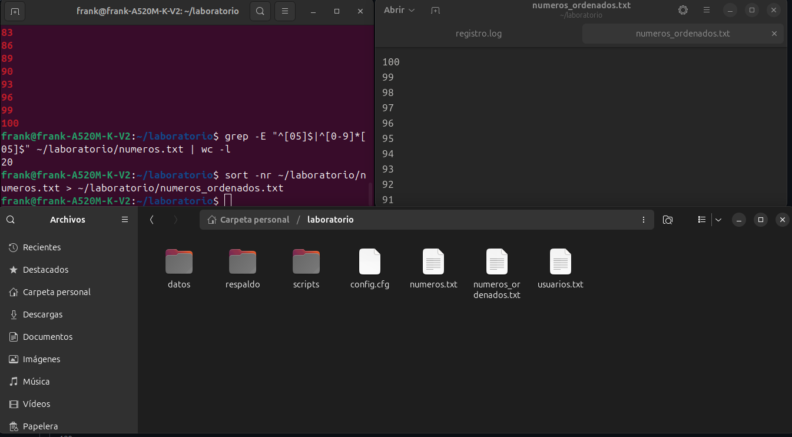

🔁 Ejercicio 2.2: Redirección y Tuberías

🎯 Objetivo:
Aprender a redirigir la salida de comandos, usar tuberías (|) y generar flujos de procesamiento.

💡 Soluciòn:
```bash
# 1. Redirección básica
ls -la > ~/laboratorio/listado.txt
echo "Nueva línea de texto" >> ~/laboratorio/listado.txt

# 2. Tuberías simples
cat /etc/passwd | grep "bash" | wc -l
```
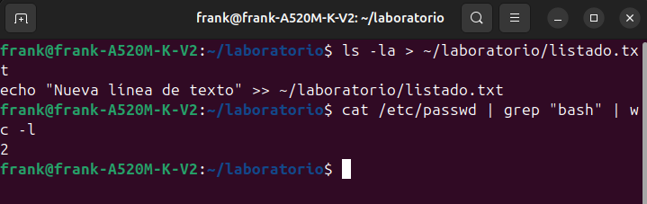

## 🧩 Ejercicio 4: Redirección y Tuberías

🎯 Objetivo:
Utilizar redirección de salida y comandos en tubería para gestionar procesos y archivos del sistema.

💡 Comandos utilizados:
```bash

# 1. Crear archivo con lista de procesos en ejecución
ps aux > ~/laboratorio/procesos.txt

# 2. Filtrar procesos del usuario actual
ps aux | grep $USER > ~/laboratorio/mis_procesos.txt

# 3. Encontrar los 5 procesos que más memoria consumen
ps aux --sort=-%mem | head -n 6 > ~/laboratorio/top_procesos.txt

# 4. Contar archivos en /etc con un único comando
ls -la /etc | wc -l
```
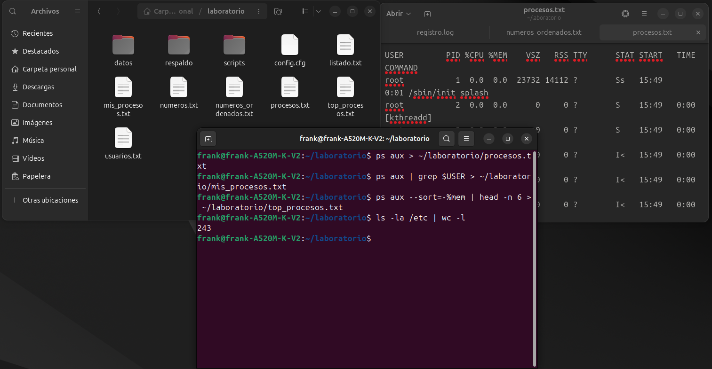

🔐 Ejercicio 2.3: Permisos y Usuarios

🎯 Objetivo:
Comprender el sistema de permisos de Linux, modificar permisos de archivos y ejecutar scripts.

💡 Comandos utilizados:
```bash
# 1. Crear un script simple
echo '#!/bin/bash' > ~/laboratorio/scripts/saludo.sh
echo 'echo "Hola, $USER. La fecha actual es $(date)"' >> ~/laboratorio/scripts/saludo.sh

# 2. Ver permisos actuales
ls -la ~/laboratorio/scripts/saludo.sh

# 3. Modificar permisos para hacer ejecutable
chmod +x ~/laboratorio/scripts/saludo.sh

# 4. Ejecutar el script
~/laboratorio/scripts/saludo.sh
```
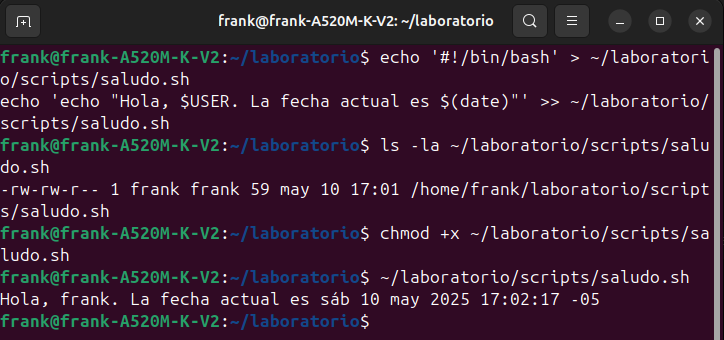

📂 Ejercicio 5: Permisos y Usuarios

🎯 Objetivo:
Comprender y modificar permisos de archivos y directorios para definir accesos adecuados.

💡 Comandos utilizados:

```bash
# 1. Crear directorio "privado"
mkdir ~/laboratorio/privado

# 2. Crear archivo "confidencial.txt"
touch ~/laboratorio/privado/confidencial.txt
echo "Información confidencial" > ~/laboratorio/privado/confidencial.txt

# 3. Configurar permisos para el archivo (solo lectura y escritura para el propietario)
chmod 600 ~/laboratorio/privado/confidencial.txt

# 4. Crear directorio "compartido" con permisos específicos
mkdir ~/laboratorio/compartido
chmod 755 ~/laboratorio/compartido

# 5. Verificar permisos
ls -la ~/laboratorio/privado
ls -la ~/laboratorio/compartido
```

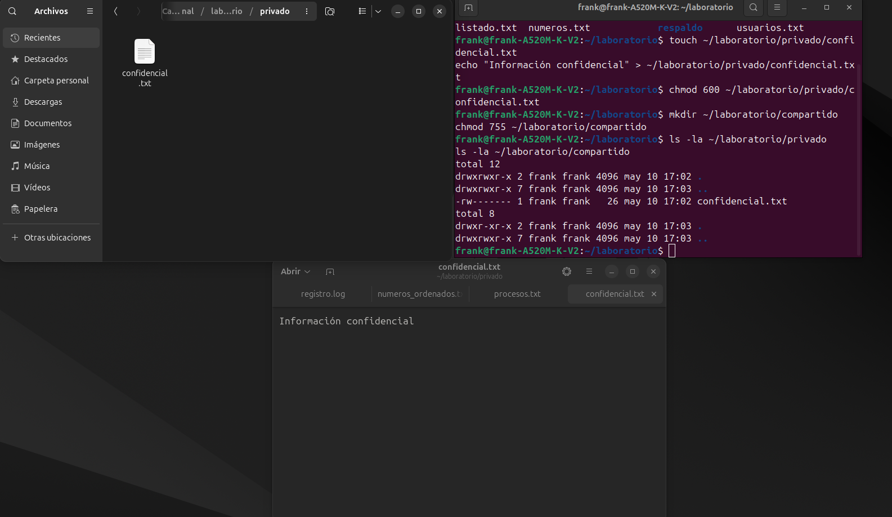

### Parte III: Comandos de nivel avanzado
🧠 Ejercicio 3.1: Procesos y Monitoreo

🎯 Objetivo:
Monitorear y controlar procesos del sistema desde la terminal.

💡 Comandos utilizados:

```bash
# 1. Ver procesos actuales (los primeros 10)
ps aux | head -10

# 2. Monitorear sistema una sola vez
top -n 1

# 3. Ejecutar proceso en segundo plano
sleep 300 &

# 4. Listar trabajos en segundo plano
jobs

# 5. Terminar proceso (por ID de trabajo)
kill %1
# O por PID:
# kill <PID>
```
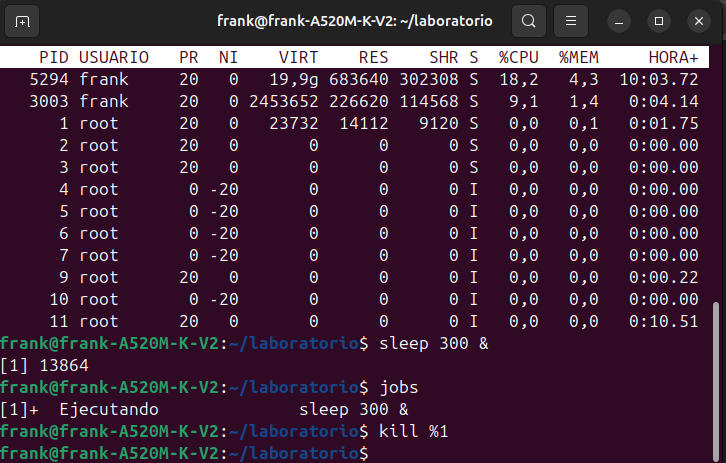

🛠️ Ejercicio 6: Scripts Básicos y Automatización

🎯 Objetivo:
Crear scripts o comandos que automaticen tareas simples.

💡 Comandos utilizados:
```bash
# 1. Ejecutar ping en segundo plano y guardar salida
ping google.com > ~/laboratorio/ping_log.txt &

# 2. Ejecutar top y aprender:
top
# Presionar "P" → ordenar por uso de CPU
# Presionar "M" → ordenar por uso de memoria
# Presionar "u" → escribir tu usuario para filtrar procesos

# 3. Identificar el proceso ping
ps aux | grep ping

# 4. Terminar proceso ping (reemplaza [PID] por el real)
kill [PID]

# 5. Verificar contenido del archivo de log
cat ~/laboratorio/ping_log.txt
```
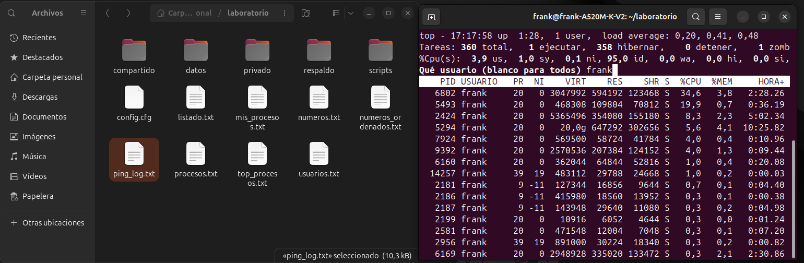

🧠 Ejercicio 3.2: Scripts Básicos y Automatización

🎯 Objetivo:
Crear scripts Bash simples que muestren información del sistema.

💡 Comandos utilizados:
```bash
# 1. Crear un script llamado info_sistema.sh
cat > ~/laboratorio/scripts/info_sistema.sh << 'EOL'
#!/bin/bash
echo "=== Información del Sistema ==="
echo "Usuario: $USER"
echo "Hostname: $(hostname)"
echo "Fecha: $(date)"
echo "Kernel: $(uname -r)"
echo "Uptime: $(uptime -p)"
echo "=== Espacio en disco ==="
df -h | grep "/dev/"
EOL

# 2. Hacer ejecutable el script
chmod +x ~/laboratorio/scripts/info_sistema.sh

# 3. Ejecutar el script
~/laboratorio/scripts/info_sistema.sh
```
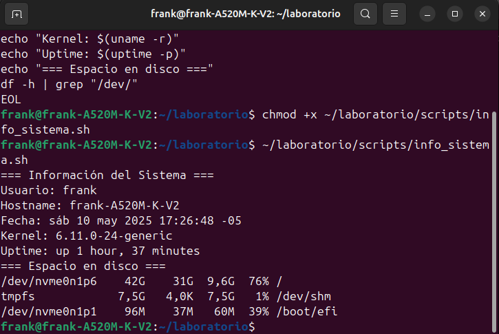

🛠️ Ejercicio 7: Scripts Bash para Automatización

🎯 Objetivo:
Automatizar la creación de respaldos con un script personalizado.

💡 Comandos utilizados:
```bash
# Crear script backup.sh
cat > ~/laboratorio/scripts/backup.sh << 'EOL'
#!/bin/bash
# Script para crear una copia de seguridad de un directorio

# Verificar si se proporcionó un directorio
if [ $# -eq 0 ]; then
    echo "Error: Debe proporcionar un directorio para hacer respaldo"
    echo "Uso: $0 <directorio>"
    exit 1
fi

# Verificar si el directorio existe
if [ ! -d "$1" ]; then
    echo "Error: El directorio $1 no existe"
    exit 1
fi

# Crear nombre de archivo con fecha
FECHA=$(date +%Y%m%d_%H%M%S)
NOMBRE_ARCHIVO="backup_${FECHA}.tar.gz"
RUTA_DESTINO=~/laboratorio/respaldo/$NOMBRE_ARCHIVO

# Crear el archivo comprimido
tar -czf $RUTA_DESTINO -C $(dirname "$1") $(basename "$1")

# Verificar si la operación fue exitosa
if [ $? -eq 0 ]; then
    TAMAÑO=$(du -h $RUTA_DESTINO | cut -f1)
    echo "Respaldo creado exitosamente en $RUTA_DESTINO"
    echo "Tamaño del archivo: $TAMAÑO"
else
    echo "Error al crear el respaldo"
fi
EOL

# Hacer ejecutable el script
chmod +x ~/laboratorio/scripts/backup.sh

# Ejecutar el script para hacer un respaldo de ~/laboratorio/datos
~/laboratorio/scripts/backup.sh ~/laboratorio/datos
```
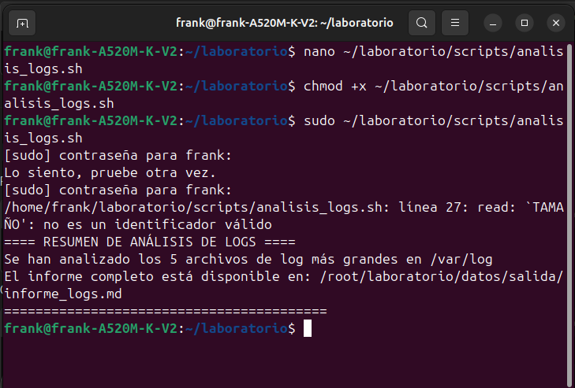

🚩 Ejercicio 3.3: Reto Final Integrador

🎯 Objetivo:
Crear un script Bash para analizar los archivos de logs del sistema y generar un informe en Markdown.

💡 Comandos utilizados:

```bash
# Crear script analisis_logs.sh
cat > ~/laboratorio/scripts/analisis_logs.sh << 'EOL'
#!/bin/bash
# Script para analizar archivos de log

# Definir constantes
DIRECTORIO_LOGS="/var/log"
ARCHIVO_SALIDA=~/laboratorio/datos/salida/informe_logs.md

# Crear directorio de salida si no existe
mkdir -p $(dirname $ARCHIVO_SALIDA)

# Crear cabecera del informe
echo "# Informe de Análisis de Logs" > $ARCHIVO_SALIDA
echo "" >> $ARCHIVO_SALIDA
echo "**Fecha y hora:** $(date)" >> $ARCHIVO_SALIDA
echo "" >> $ARCHIVO_SALIDA
echo "## Archivos analizados" >> $ARCHIVO_SALIDA
echo "" >> $ARCHIVO_SALIDA
echo "| Archivo | Tamaño | Errores encontrados |" >> $ARCHIVO_SALIDA
echo "|---------|--------|---------------------|" >> $ARCHIVO_SALIDA

# Encontrar los 5 archivos de log más grandes
ARCHIVOS_GRANDES=$(find $DIRECTORIO_LOGS -name "*.log" -type f -exec du -h {} \; | sort -hr | head -5)

# Archivo con más errores
MAX_ERRORES=0
ARCHIVO_MAX=""

# Procesar archivos
echo "$ARCHIVOS_GRANDES" | while read TAMAÑO ARCHIVO; do
    if [ -r "$ARCHIVO" ]; then
        NUM_ERRORES=$(grep -i "error" "$ARCHIVO" 2>/dev/null | wc -l)
        if [ $NUM_ERRORES -gt $MAX_ERRORES ]; then
            MAX_ERRORES=$NUM_ERRORES
            ARCHIVO_MAX=$ARCHIVO
        fi
        echo "| $(basename $ARCHIVO) | $TAMAÑO | $NUM_ERRORES |" >> $ARCHIVO_SALIDA
    else
        echo "| $(basename $ARCHIVO) | $TAMAÑO | Sin acceso |" >> $ARCHIVO_SALIDA
    fi
done

echo "" >> $ARCHIVO_SALIDA
echo "## Últimos errores encontrados" >> $ARCHIVO_SALIDA
echo "" >> $ARCHIVO_SALIDA

# Mostrar últimos errores
if [ -n "$ARCHIVO_MAX" ] && [ -r "$ARCHIVO_MAX" ]; then
    echo "### En $(basename $ARCHIVO_MAX):" >> $ARCHIVO_SALIDA
    echo "" >> $ARCHIVO_SALIDA
    echo '```' >> $ARCHIVO_SALIDA
    grep -i "error" "$ARCHIVO_MAX" 2>/dev/null | tail -3 >> $ARCHIVO_SALIDA
    echo '```' >> $ARCHIVO_SALIDA
else
    echo "No se pudo acceder al archivo con más errores." >> $ARCHIVO_SALIDA
fi

# Mostrar resumen
echo "==== RESUMEN DE ANÁLISIS DE LOGS ===="
echo "Se han analizado los 5 archivos de log más grandes en $DIRECTORIO_LOGS"
echo "El informe completo está disponible en: $ARCHIVO_SALIDA"
echo "========================================="
EOL

# Hacer ejecutable el script
chmod +x ~/laboratorio/scripts/analisis_logs.sh

# Ejecutar el script (con permisos de superusuario si es necesario)
sudo ~/laboratorio/scripts/analisis_logs.sh
```


