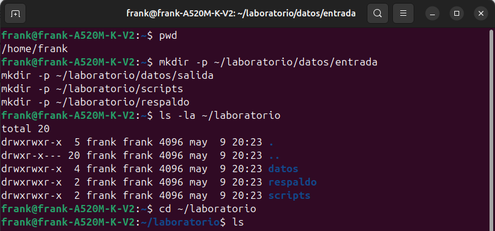

# 🧪 Laboratorio 06: Comandos de Terminal en Linux

**Curso:** Sistemas Operativos  
**Tema:** Manejo de comandos de terminal en Linux  
**Autor:** [Jauregui Bendezu, Frank Kevin]  
**Fecha:** [07/05/2025]

---

## 🎯 Objetivos del Laboratorio

- ✅ Familiarización con el entorno de terminal de Linux.  
- ✅ Desarrollo de habilidades prácticas en la ejecución de comandos de terminal.  
- ✅ Progresión desde comandos básicos hasta tareas más avanzadas.  
- ✅ Comprensión de conceptos fundamentales de la línea de comandos de Linux.

---

## 🧩 Parte I: Comandos de Nivel Básico

### 📁 Ejercicio 1.1: Navegación y Gestión de Archivos

**🎯 Objetivo:**  
Crear una estructura de directorios y realizar operaciones básicas con archivos.

**💡 Solución:**

```bash
# 1. Verificar ubicación actual
pwd

# 2. Crear la estructura de directorios
mkdir -p ~/laboratorio/datos/entrada
mkdir -p ~/laboratorio/datos/salida
mkdir -p ~/laboratorio/scripts
mkdir -p ~/laboratorio/respaldo

# 3. Verificar la estructura creada
ls -la ~/laboratorio


