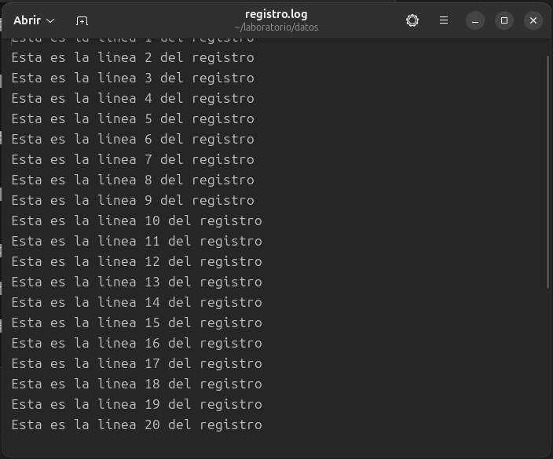

# Laboratorio 06: Comandos de Terminal en Linux

**Curso:** Sistemas Operativos  
**Tema:** Manejo de comandos de terminal en Linux  
**Autor:** [Jauregui Bendezu, Frank Kevin]  
**Fecha:** [07/05/2025]

---

## 🎯 Objetivos del Laboratorio

- ✅ Familiarización con el entorno de terminal de Linux.  
- ✅ Desarrollo de habilidades prácticas en la ejecución de comandos de terminal.  
- ✅ Progresión desde comandos básicos hasta tareas más avanzadas.  
- ✅ Comprensión de conceptos fundamentales de la línea de comandos de Linux.

---

## 🧩 Parte I: Comandos de Nivel Básico

### 📁 Ejercicio 1.1: Navegación y Gestión de Archivos

**🎯 Objetivo:**  
Crear una estructura de directorios y realizar operaciones básicas con archivos.

**💡 Solución:**

```bash
# 1. Verificar ubicación actual
pwd

# 2. Crear la estructura de directorios
mkdir -p ~/laboratorio/datos/entrada
mkdir -p ~/laboratorio/datos/salida
mkdir -p ~/laboratorio/scripts
mkdir -p ~/laboratorio/respaldo

# 3. Verificar la estructura creada
ls -la ~/laboratorio
```


📁 Ejercicio 1: Operaciones con Archivos

🎯 Objetivo:
Practicar navegación entre directorios y manipulación básica de archivos.

💡 Solución:

```bash
# 4. Navegar entre los diferentes directorios
cd ~/laboratorio
cd datos
cd entrada

# 5. Crear tres archivos de texto vacíos
touch datos1.txt datos2.txt config.cfg

# 6. Copiar "datos1.txt" al directorio "respaldo"
cp datos1.txt ~/laboratorio/respaldo/

# 7. Mover "config.cfg" al directorio raíz del laboratorio
mv config.cfg ~/laboratorio/

# 8. Eliminar "datos2.txt"
rm datos2.txt
```


📁 Ejercicio 1.2: Visualización y Edición Básica

🎯 Objetivo:
Crear archivos con contenido, visualizar su información y realizar ediciones simples con herramientas básicas.

💡 Solución:

```bash
# 1. Crear un archivo con contenido
echo "Esta es la primera línea del archivo" > ~/laboratorio/datos/entrada/datos1.txt
echo "Esta es la segunda línea del archivo" >> ~/laboratorio/datos/entrada/datos1.txt
echo "Esta es la tercera línea del archivo" >> ~/laboratorio/datos/entrada/datos1.txt
echo "Esta es la cuarta línea del archivo" >> ~/laboratorio/datos/entrada/datos1.txt
echo "Esta es la quinta línea del archivo" >> ~/laboratorio/datos/entrada/datos1.txt

# 2. Visualizar contenido completo
cat ~/laboratorio/datos/entrada/datos1.txt

# 3. Visualizar las primeras 3 líneas
head -n 3 ~/laboratorio/datos/entrada/datos1.txt

# 4. Visualizar las últimas 2 líneas
tail -n 2 ~/laboratorio/datos/entrada/datos1.txt
```


🗃️ Ejercicio 2: Manipulación de Archivos con Bucle y Editor

🎯 Objetivo:
Crear múltiples líneas con un bucle, visualizar partes del archivo y editar contenido.

💡 Solución:

```bash
# 1. Crear un archivo registro.log con 20 líneas
cd ~/laboratorio/datos
for i in {1..20}; do
    echo "Esta es la línea $i del registro" >> registro.log
done

# 2. Visualizar las primeras 5 líneas
head -n 5 registro.log

# 3. Visualizar las últimas 3 líneas
tail -n 3 registro.log

# 4. Abrir el archivo con nano y agregar una línea al inicio
nano registro.log
# Agregar manualmente: "# ARCHIVO DE REGISTRO" al inicio

# 5. Visualizar archivo completo
cat registro.log
```




